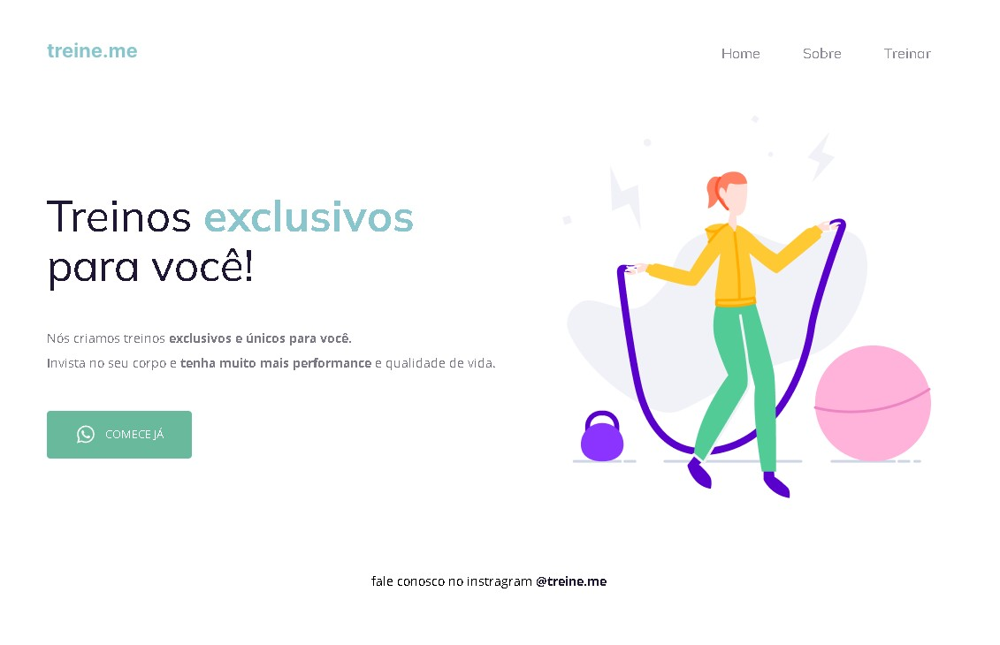

<h1 align="center"> Projeto 02 Explorer </h1>

# 🚀 Trilha Explorer

> Projeto desenvolvido durante o curso Explorer da Rocketseat!

[🔗Clique para acessar](https://moveis-customizados-psi.vercel.app/)

## 🛠 Tecnologias utilizadas

- HTML
- CSS
- Git e Github

## 🔖 Layout

Você pode visualizar o layout do projeto através [DESSE LINK](https://www.figma.com/file/rkDOHGPwwFtBNqEdHSuQPd/Projeto-02---Explorer?node-id=0%3A1&t=YAEbZKxRSALATasj-0). É necessário ter conta no [Figma](https://figma.com) para acessá-lo.

## 💻 Contato

isabelalvaro116@gmail.com

